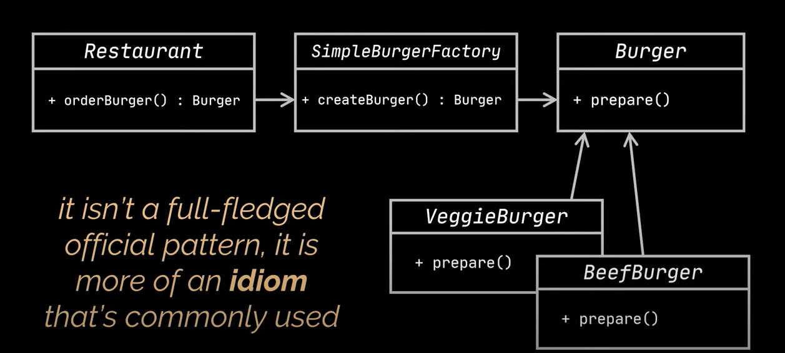

# Design Patterns Notes - Factory - 5

## Factory Patterns

- **Simple Factory**
- **Factory Method**
- **Abstract Factory**

### Simple Factory

- This defines a class that encapsulates the object creation for the product.
- This is NOT actually a design pattern; it is more of a programming idiom.
- This is often mistaken for the Factroy pattern but it is not a REAL pattern.

```java
public class Restaurant {
    public Burger orderBurger(String request) {
        SimpleBurgerFactory burgerFactory = new SimpleBurgerFactory();
        Burger burger = burgerFactory.createBurger();
        burger.prepare();
        return burger;
    }
}

public class SimpleBurgerFactory {
    public Burger createBurger(String request) {
        Burger burger = null;
        if("CHICKEN".equals(request)) {
            burger = new ChickenBurger();
        } else if("VEG".equals(request)) {
            burger = new VegBurger();
        }
        return burger;
    }
}

public interface Burger {
    void prepare();
}

public class ChickenBurger implements Burger {
    @Override
    void prepare() {
        // prepare chicken
        // business logic
    }
}

public class VegBurger implements Burger {
    @Override
    void prepare() {
        // prepare veggies
        // business logic
    }
}
```



### Factory Method
