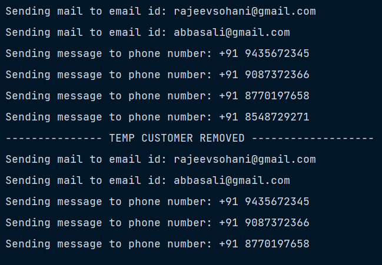

# Design Patterns Notes - Observer - 11

### Observer Pattern

- Behavioral Design Pattern

- Observer pattern lets you define a subscription mechanism to notify multiple objects about any events that happen to the object they’re observing.

```java
// Store
public class Store {
    private final NotificationService notificationService;

    public Store() {
        notificationService = new NotificationService();
    }

    public void promoteNewItem() {
        this.notificationService.notifyService();
    }

    public NotificationService getNotificationService() {
        return this.notificationService;
    }
}

// NotificationService
public class NotificationService {
    private final List<IEventListener> listeners;

    public NotificationService() {
        this.listeners = new ArrayList<>();
    }

    public void subscribe(IEventListener listener) {
        this.listeners.add(listener);
    }

    public void unsubscribe(IEventListener listener) {
        this.listeners.remove(listener);
    }

    public void notifyService() {
        listeners.forEach(IEventListener::update);
    }
}

// IEventListener
public interface IEventListener {
    void update();
}

// EmailListener
public class EmailListener implements IEventListener{
    private final String emailAddress;

    public EmailListener(String emailAddress) {
        this.emailAddress = emailAddress;
    }

    @Override
    public void update() {
        System.out.println("Sending mail to email id: " + emailAddress);
    }
}

// MobileListener
public class MobileListener implements IEventListener{
    private final String phoneNumber;

    public MobileListener(String phoneNumber) {
        this.phoneNumber = phoneNumber;
    }

    @Override
    public void update() {
        System.out.println("Sending message to phone number: " + phoneNumber);
    }
}
```

#### Client code -

```java
public class Client {
    public static void main(String[] args) {
        Store store = new Store();
        store.getNotificationService().subscribe(new EmailListener("rajeevsohani@gmail.com"));
        store.getNotificationService().subscribe(new EmailListener("abbasali@gmail.com"));
        store.getNotificationService().subscribe(new MobileListener("+91 9435672345"));
        store.getNotificationService().subscribe(new MobileListener("+91 9087372366"));
        store.getNotificationService().subscribe(new MobileListener("+91 8770197658"));

        MobileListener tempCustomer = new MobileListener("+91 8548729271");
        store.getNotificationService().subscribe(tempCustomer);


        store.promoteNewItem();

        store.getNotificationService().unsubscribe(tempCustomer);

        System.out.println("--------------- TEMP CUSTOMER REMOVED -------------------");

        store.promoteNewItem();

    }
}
```

#### Code Output -


