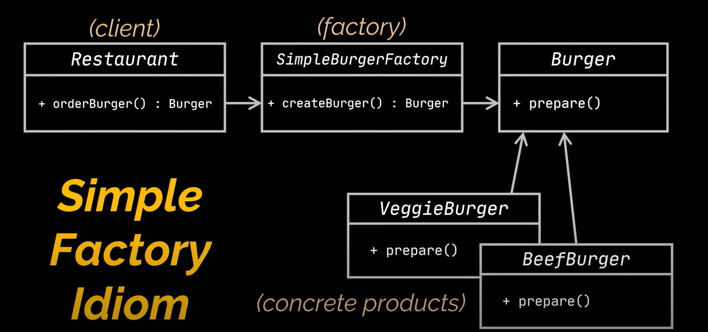
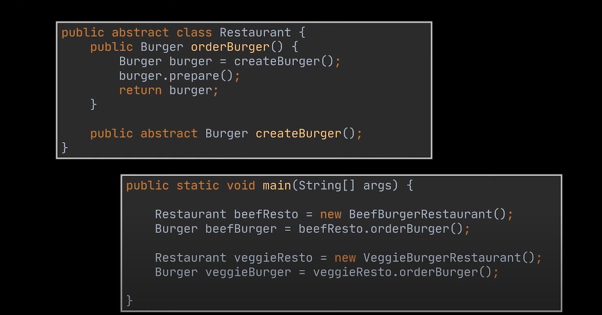
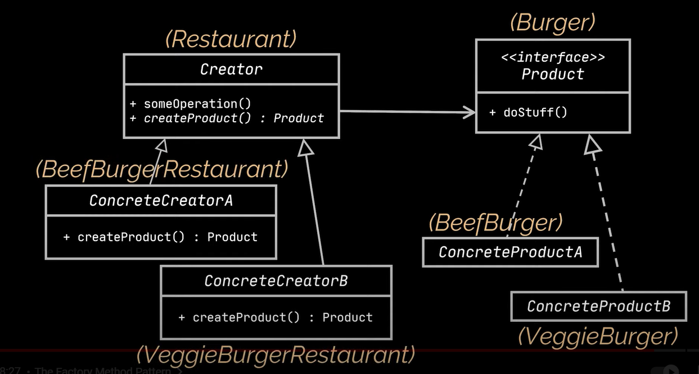
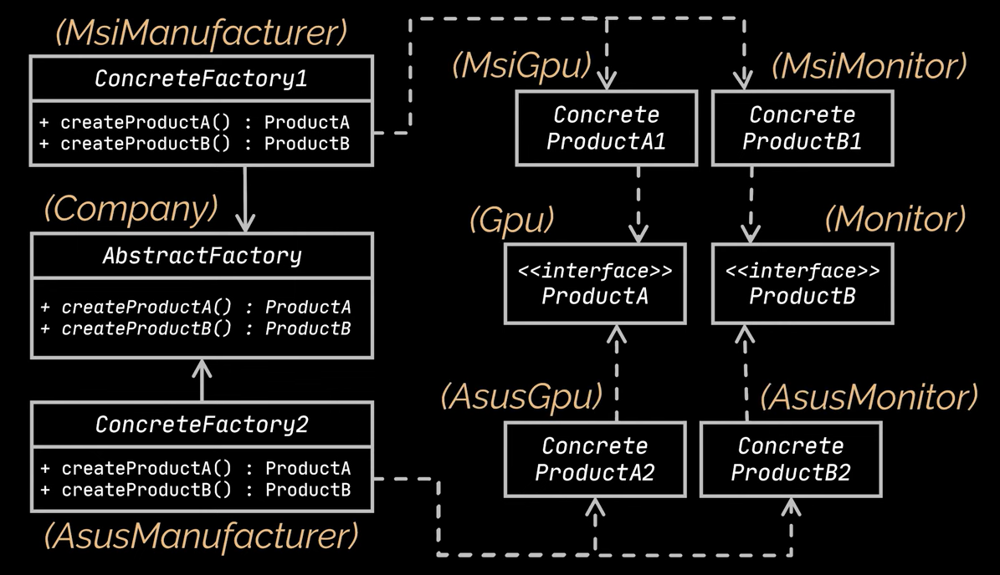

# Design Patterns Notes - Factory - 5

## Factory Patterns

- Creational Design Pattern

- Factory patterns can be classified into 3 more patterns -
  - [**Simple Factory**](#simple-factory)
  - [**Factory Method**](#factory-method)
  - [**Abstract Factory**](#abstract-factory)

### Simple Factory

- This defines a class that encapsulates the object creation for the product.
- This is NOT actually a design pattern; it is more of a programming idiom.
- This is often mistaken for the Factory pattern but it is not a REAL pattern.

```java
public class Restaurant {
    public Burger orderBurger(String request) {
        SimpleBurgerFactory burgerFactory = new SimpleBurgerFactory();
        Burger burger = burgerFactory.createBurger("VEG");
        burger.prepare();
        return burger;
    }
}

public class SimpleBurgerFactory {
    public Burger createBurger(String request) {
        Burger burger = null;
        if("CHICKEN".equals(request)) {
            burger = new ChickenBurger();
        } else if("VEG".equals(request)) {
            burger = new VegBurger();
        }
        return burger;
    }
}

public interface Burger {
    void prepare();
}

public class ChickenBurger implements Burger {
    @Override
    void prepare() {
        // prepare chicken
        // business logic
    }
}

public class VegBurger implements Burger {
    @Override
    void prepare() {
        // prepare veggies
        // business logic
    }
}
```


_URL: https://youtu.be/EdFq_JIThqM?si=LK8m_6OsiOskVp2y&t=201_

### Factory Method

- The Factory Method decides an interface for creating an object but lets subclasses decide which class to instantiate.
- This pattern lets a class defer instantiation to its subclasses.

```java
public abstract class Restaurant {
    public Burger orderBurger() {
        Burger burger = createBurger();
        burger.prepare();
        return burger;
    }

    public abstract Burger createBurger();
}

public class ChickenBurgerRestaurant extends Restaurant {
    @Override
    public Burger createBurger() {
        return new ChickenBurger();
    }
}

public class VegBurgerRestaurant extends Restaurant {
    @Override
    public Burger createBurger() {
        return new VegBurger();
    }
}

public interface Burger {
    void prepare();
}

public class ChickenBurger implements Burger {
    @Override
    void prepare() {
        // prepare chicken
        // business logic
    }
}

public class VegBurger implements Burger {
    @Override
    void prepare() {
        // prepare veggies
        // business logic
    }
}
```


_URL: https://youtu.be/EdFq_JIThqM?si=v6XMnnNHPIC20csr&t=361_


_URL: https://youtu.be/EdFq_JIThqM?si=ImdWQKmsJuVx2pYr&t=399_

### Abstract Factory

- The Abstract Factory Pattern provides an interface for creating families of related or dependent objects without specifying their concrete classes.

```java
public abstract class Restaurant {
    public Burger orderBurger() {
        Burger burger = createBurger();
        burger.prepare();
        return burger;
    }

    public Pizza orderPizza() {
        Pizza pizza = createPizza();
        pizza.prepare();
        return pizza;
    }

    public abstract Burger createBurger();
    public abstract Pizza createPizza();
}


public class VegRestaurant extends Restaurant {
    @Override
    public VegBurger createBurger() {
        return new VegBurger();
    }

    @Override
    public VegPizza createPizza() {
        return new VegPizza();
    }
}

public class ChickenRestaurant extends Restaurant {
    @Override
    public ChickenBurger createBurger() {
        return new ChickenBurger();
    }

    @Override
    public ChickenPizza createPizza() {
        return new ChickenPizza();
    }
}

public interface Burger {
    void prepare();
}

public class ChickenBurger implements Burger {
    @Override
    public void prepare() {
        // prepare chicken
        // business logic
    }
}


public class VegBurger implements Burger {
    @Override
    void prepare() {
        // prepare veggies
        // business logic
    }
}

public interface Pizza {
    void prepare();
}

public class ChickenPizza implements Pizza {
    @Override
    void prepare() {
        // prepare chicken
        // business logic
    }
}

public class VegPizza implements Pizza {
    @Override
    void prepare() {
        // prepare veggies
        // business logic
    }
}

```


_URL: https://youtu.be/QNpwWkdFvgQ?si=S-5dmvbenlWZDhoZ&t=324_
