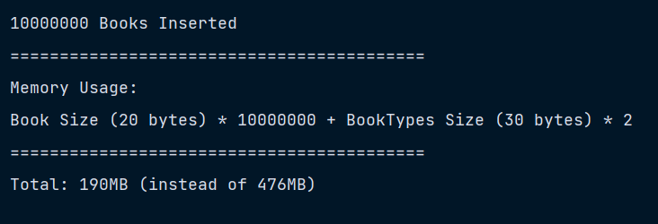

# Design Patterns Notes - Flyweight - 9

### Flyweight Pattern

- Structural Design Pattern

- The Flyweight design pattern aims to minimize memory usage by sharing common data between multiple objects.

- It is especially useful when dealing with large numbers of similar objects to improve performance and reduce memory footprint.

- It focuses on optimizing memory usage by sharing common state between multiple objects. Instead of each object holding its own data, the pattern separates the intrinsic (shared) state and the extrinsic (unique) state of an object.

- The intrinsic state is shared among multiple objects, while the extrinsic state can vary.

```java

// Models
// Book
public class Book {
    public String name;
    public double price;
    public BookType bookType;

    Book(String name, double price, BookType bookType) {
        this.name = name;
        this.price = price;
        this.bookType = bookType;
    }
}

// Models
// BookType
public class BookType {
    public String category;
    public String publisher;
    public String location;

    BookType(String category, String publisher, String location) {
        this.category = category;
        this.publisher = publisher;
        this.location = location;
    }
}

// Factory
public class BookTypeFactory {
    static Map<String, BookType> bookTypes = new HashMap<>();

    public static BookType getBookType(String category, String publisher, String location) {
        if(!bookTypes.containsKey(category)) {
            bookTypes.put(category, new BookType(category, publisher, location));
        }
        return bookTypes.get(category);
    }
}

// Store
public class Store {
    List<Book> books = new ArrayList<>();

    public void storeBooks(String name, double price, String category, String publisher, String location) {
        BookType bookType = BookTypeFactory.getBookType(category, publisher, location);
        books.add(new Book(name, price, bookType));
    }

    public void display() {
        books.forEach(System.out::println);
    }
}
```

#### Client code -

```java
public class Client {
    public static void main(String[] args) {
        final int BOOKS_TO_INSERT = 10_000_000;
        final int BOOK_TYPES = 2;

        Store myStore = new Store();

        for(int i = 0; i < BOOKS_TO_INSERT/BOOK_TYPES; i++) {
            myStore.storeBooks(getRandomName(), getRandomPrice(), "Fiction", "Dream-house Publishers Ltd.", "Bengaluru");
            myStore.storeBooks(getRandomName(), getRandomPrice(), "Biography", "MacMohan & Brothers Ltd.", "Pune");
        }

        System.out.println(BOOKS_TO_INSERT + " Books Inserted");
        System.out.println("==========================================");
        System.out.println("Memory Usage: ");
        System.out.println("Book Size (20 bytes) * " + BOOKS_TO_INSERT + " + BookTypes Size (30 bytes) * " + BOOK_TYPES + "");
        System.out.println("==========================================");
        System.out.println("Total: " + ((BOOKS_TO_INSERT * 20 + BOOK_TYPES * 30) / 1024 / 1024) + "MB (instead of " + ((BOOKS_TO_INSERT * 50) / 1024 / 1024) + "MB)");


    }

    public static String getRandomName() {
        List<String> bookNames = List.of("book1", "book2", "book3", "book4", "book5");
        return bookNames.get(new Random().nextInt(bookNames.size()));
    }

    public static double getRandomPrice() {
        return new Random().nextDouble(100);
    }
}
```

#### Output -


