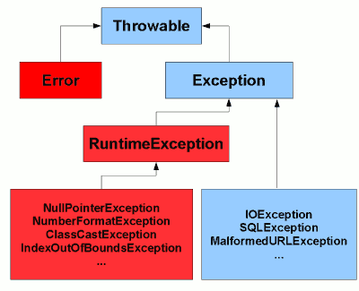

# Exception Handling

### 1. What is an exception?

An exception is an abnormal condition that arises in a code sequence at run time which disrupts the flow of normal program execution that unless handled could lead to the termination of the program.

### 2. Describe in brief the important keywords in exception handling in Java.

- **try** - Program statements that you want to monitor for exceptions are contained within a try block. If an exception occurs within the try block, it is thrown.
- **catch** - The exception thrown is caught by the catch block and can be handled in some rational manner.
- **throw** - To manually throw an excpetion, use the throw keyword.
- **throws** - If a method is capable of causing/throwing an exception that it does not handle itself, it must specify this bheaviour so that callers of the method can guard themselves against this exception. This is necesary for all exceptions except those of type **Error** or **RuntimeException** or any of their subclasses.
- **finally** - Any code that absolutely must be executed after a try block completes is put in a finally block. This is optional, however, each try statement requires **at least one catch or finally** statement.

### 3. How to use multiple catch blocks?

When you use multiple catch statements, it is important to remember that exception subclasses must come before any of their superclasses.

Because a catch statement that uses a superclass will catch exceptions of that type plus any of its subclasses.

Thus, a subclass would never be reached if it cam after its superclass.

NOTE:

If you try to compile a program where a subclass Exception catch statement comes after its superclass Exception catch statement then you will receive an error message stating that second catch statement is unreachable because the exception has already been caught (Unreachable catch block error).

### 4. What is the exception hierarchy in Java?

All exception types are subclasses of the built-in class **Throwable**.

Immediately below **Throwable** are 2 subclasses that partition into 2 distinct branches - **Exception** and **Error**.

Exception is the class that we will subclass to handle our own custom exceptions.
There is another important subclass of this - **RuntimeException**.

**Error** is not handled in general as these are catastrophic failures that cannot usually be handled in a program.



### 5. What are the scenarios where finally block is not executed?

Finally statement is always executed except in very few scenarios. They are:

- System.exit() is called
- JVM crashes due to infinite loop/deadlock, or some other kind of fatal error.

### 6. What are checked and unchecked exceptions?

**Checked Exceptions**

These are exceptions that the Java compiler forces you to handle or declare at compile-time.
They extend from the Exception class (or any subclass of Exception that doesn't extend RuntimeException).

If a method can throw a checked exception, it must either handle it using a try-catch block or declare it in its throws clause.

The purpose of checked exceptions is to ensure that exceptional conditions are properly handled by the developer, preventing unexpected runtime errors.

**Unchecked Exceptions (Runtime Exceptions)**

These are exceptions that the Java compiler does not force you to handle or declare.

They extend from RuntimeException, or its subclasses.

Unchecked exceptions usually occur due to programming errors, and they can be prevented by writing quality code.

Unlike checked exceptions, you are not required to catch or declare unchecked exceptions. However, you can still handle them if needed.

### 7. What are chained exceptions?

Chained exceptions allows us to associate one exception with another. The second exception describes the cause of the first exception.

For example, imagin a scenario where a method throws `ArithmethicException` because of an attempt to divide by zero. However, the actual cause of the problem was an `IOException` that occurred which caused the divisor to be set to zero.

Although the method must throw an `ArithmethicException`, it is also important to let the user know why such an exception occurred.

When an exception occurs, you can create a new exception object that encapsulates the original exception.

This can be done using one of the constructors of the `Throwable` class (the superclass of all exceptions) that accepts both a message and a cause (another throwable object).

```java
try {
    // Code that may throw an exception
} catch (IOException e) {
    // Wrap the original exception with a new one, providing additional context
    throw new MyException("An error occurred while performing operation X", e);
}
```

You can access the chained exception using the `getCause()` method provided by the `Throwable` class.

This method returns the throwable object that was passed as the cause when creating the exception.

```java
try {
    // Code that may throw an exception
} catch (MyException ex) {
    // Retrieve the original cause of the exception
    Throwable cause = ex.getCause();
    if (cause != null) {
        // Handle or log the original cause
    }
}
```

### 8. What is a multi-catch statement?

The multi-catch statement allows you to catch multiple types of exceptions in a single catch block.

```java
try {
    // Code that may throw exceptions
} catch (IOException | SQLException | SomeOtherException e) {
    // Handle all specified exceptions in one catch block
    // You can use 'e' to reference the caught exception
    // Common exception handling code goes here
}
```

These exception types should be unrelated in the inheritance hierarchy to avoid redundancy or ambiguity.
